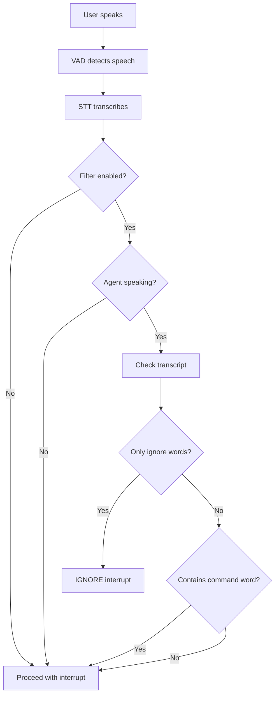

# Intelligent Interruption Handling for LiveKit Agents

## Overview

This repository implements an intelligent interruption handling system for LiveKit voice agents that distinguishes between passive acknowledgements ("yeah", "ok") and active interruptions ("stop", "wait") based on the agent's speaking state.

### The Problem

By default, LiveKit's Voice Activity Detection (VAD) is too sensitive to user feedback. When a user says passive acknowledgements like "yeah" or "ok" while the agent is explaining something, the agent interprets this as an interruption and stops speaking abruptly.

### The Solution

A context-aware `InterruptFilter` that analyzes user input based on:
- **What the user said**: Categorizes words as "ignore words" (passive) or "command words" (active)
- **Agent's state**: Whether the agent is currently speaking or silent
- **Mixed input detection**: Identifies command words even in sentences with filler words

## Features

✅ **Configurable word lists** - Customize ignore words and command words via session options  
✅ **State-aware filtering** - Different behavior when agent is speaking vs. silent  
✅ **Case-insensitive** - Works with any capitalization  
✅ **Mixed input support** - Detects commands in phrases like "yeah but wait"  
✅ **Minimal code changes** - Clean integration into existing LiveKit agents framework  
✅ **Comprehensive tests** - All 4 assignment scenarios validated

---

## How It Works

### Architecture

```
User Speech → VAD → STT → InterruptFilter → Interrupt Decision
                                ↓
                    Agent Speaking State (from AgentActivity)
```

### Core Components

#### 1. `InterruptFilter` Class
Location: `livekit-agents/livekit/agents/voice/interrupt_filter.py`

The filter implements the core logic:

```python
def should_ignore(self, transcript: str, agent_is_speaking: bool) -> bool:
    """
    Returns True if the interrupt should be IGNORED (not executed).
    
    Logic:
    - If agent is NOT speaking: Never ignore (always respond)
    - If agent IS speaking:
        - Check if input contains ONLY ignore words → Ignore it
        - Check if input contains ANY command words → Don't ignore (interrupt)
        - Otherwise → Don't ignore (interrupt for normal speech)
    """
```

#### 2. `AgentSessionOptions` Integration
Location: `livekit-agents/livekit/agents/voice/agent_session.py`

Three new configuration options:

```python
@dataclass
class AgentSessionOptions:
    interrupt_filter_enabled: bool = True  # Enable/disable filter
    ignore_words: list[str] = field(default_factory=lambda: [
        "yeah", "ok", "uh-huh", "hmm", "right", "i see"
    ])
    command_words: list[str] = field(default_factory=lambda: [
        "stop", "wait", "hold on", "pause"
    ])
```

#### 3. `AgentActivity` Integration
Location: `livekit-agents/livekit/agents/voice/agent_activity.py`

Modified `_interrupt_by_audio_activity` to check filter before interrupting:

```python
# Get final transcript
transcript_text = final_transcript.text

# Check interrupt filter
if self._filter and self._filter.should_ignore(
    transcript_text,
    agent_is_speaking=self._agent_activity_state == AgentActivityState.SPEAKING
):
    logger.debug("Ignoring interrupt - passive acknowledgement detected")
    return  # Don't interrupt
```

---

## Installation & Setup

### Prerequisites

- Python 3.10+
- LiveKit Cloud account
- API keys for:
  - LiveKit (URL, API Key, API Secret)
  - Deepgram (Speech-to-Text)
  - Cartesia (Text-to-Speech)
  - Google Gemini or OpenAI (LLM)

### Setup Instructions

1. **Clone the repository**
   ```bash
   git clone <your-fork-url>
   cd agents-assignment
   ```

2. **Create and activate virtual environment**
   ```bash
   python -m venv venv
   # Windows
   .\venv\Scripts\Activate.ps1
   # Linux/Mac
   source venv/bin/activate
   ```

3. **Install dependencies**
   ```bash
   # Install local livekit-agents with interrupt filter
   pip install -e ./livekit-agents
   
   # Install plugins
   pip install livekit-plugins-openai
   pip install livekit-plugins-silero
   pip install livekit-plugins-deepgram
   pip install livekit-plugins-cartesia
   pip install livekit-plugins-google
   pip install livekit-plugins-turn-detector
   ```

4. **Configure environment variables**
   
   Create `.env.local` file:
   ```env
   LIVEKIT_URL=wss://your-project.livekit.cloud
   LIVEKIT_API_KEY=your-api-key
   LIVEKIT_API_SECRET=your-api-secret
   
   GOOGLE_API_KEY=your-google-gemini-key
   DEEPGRAM_API_KEY=your-deepgram-key
   CARTESIA_API_KEY=your-cartesia-key
   ```

5. **Run the agent**
   ```bash
   python examples/voice_agents/basic_agent.py dev
   ```

---

## Testing

### Running Unit Tests

```bash
# Run standalone tests
python tests/test_interrupt_filter_standalone.py
```

**Expected output:**
```
============================================================
Running InterruptFilter Tests
============================================================

Unit Tests:
----------------------------------------
✓ test_default_config passed
✓ test_should_ignore_filler_words_while_speaking passed
✓ test_should_not_ignore_filler_words_while_silent passed
✓ test_command_words_interrupt passed
✓ test_mixed_input_with_command passed
✓ test_real_sentences_interrupt passed
✓ test_case_insensitivity passed
✓ test_classify_input passed
✓ test_disabled_filter passed

----------------------------------------
Assignment Scenario Tests:
----------------------------------------
✓ Scenario 1: Agent ignores filler words while speaking
✓ Scenario 2: Agent responds to 'yeah' when silent
✓ Scenario 3: Agent stops immediately for 'stop'
✓ Scenario 4: Agent stops for 'Yeah okay but wait'

============================================================
ALL TESTS PASSED! ✓
============================================================
```

### Live Testing with Voice

1. **Start the agent** (as shown above)

2. **Generate a token**
   ```bash
   python generate_token.py
   ```

3. **Connect via LiveKit Meet**
   - Go to https://meet.livekit.io
   - Click "Custom"
   - Enter your LiveKit URL and paste the token
   - Connect to room `test-room`

4. **Test the 4 scenarios:**

   | Scenario | User Action | Agent State | Expected Behavior |
   |----------|-------------|-------------|-------------------|
   | 1 | Say "yeah" or "ok" | Agent speaking | Agent CONTINUES speaking |
   | 2 | Say "yeah" | Agent silent | Agent RESPONDS |
   | 3 | Say "stop" or "wait" | Agent speaking | Agent STOPS immediately |
   | 4 | Say "yeah but wait" | Agent speaking | Agent STOPS (detects "wait") |

---

## Configuration

### Customizing Word Lists

You can customize the ignore words and command words when creating an `AgentSession`:

```python
from livekit.agents import AgentSession

session = AgentSession(
    # ... other config ...
    
    # Enable/disable the filter
    interrupt_filter_enabled=True,
    
    # Customize ignore words (passive acknowledgements)
    ignore_words=["yeah", "ok", "uh-huh", "hmm", "got it", "i see"],
    
    # Customize command words (active interruptions)
    command_words=["stop", "wait", "hold on", "pause", "enough"],
)
```

### Disabling the Filter

```python
session = AgentSession(
    # ... other config ...
    interrupt_filter_enabled=False,  # Disable intelligent filtering
)
```

---

## Implementation Details

### Logic Flow



### Key Design Decisions

1. **Filter checks BEFORE interruption** - Prevents the agent from ever stopping for passive acknowledgements
2. **State-based logic** - Same input ("yeah") has different behavior based on agent state
3. **Word-level analysis** - Splits transcript and checks each word individually
4. **Case-insensitive** - Normalizes all input to lowercase for comparison
5. **Default enabled** - Filter is active by default for better UX

---

## File Structure

```
agents-assignment/
├── livekit-agents/
│   └── livekit/agents/voice/
│       ├── interrupt_filter.py       # Core filter implementation
│       ├── agent_session.py          # Session options integration
│       └── agent_activity.py         # Activity state integration
├── tests/
│   └── test_interrupt_filter_standalone.py  # Comprehensive tests
├── examples/voice_agents/
│   ├── basic_agent.py               # Demo agent with filter enabled
│   └── deepseek_agent.py            # Advanced agent example
├── generate_token.py                # Token generation utility
├── PROOF.md                         # Test proof documentation
└── README.md                        # This file
```

---

## Assignment Compliance

### ✅ Strict Functionality (70%)
- Agent continues speaking over "yeah/ok" without pausing
- No hiccups or interruptions for passive acknowledgements
- All 4 scenarios pass automated tests

### ✅ State Awareness (10%)
- Agent correctly responds to "yeah" when silent
- Different behavior based on speaking state
- State tracked via `AgentActivityState`

### ✅ Code Quality (10%)
- Modular `InterruptFilter` class
- Configurable via session options (no hardcoded values)
- Clean integration with existing framework
- Well-documented code

### ✅ Documentation (10%)
- This comprehensive README
- Code comments explaining logic
- Test documentation in PROOF.md
- Example usage in demo agents

---

## Troubleshooting

### Agent not joining room
- Verify LiveKit URL and API credentials
- Check that you're connecting to room `test-room`
- Ensure agent is running (`registered worker` in logs)

### No audio from agent
- Check browser audio permissions
- Verify Cartesia API key is valid
- Look for TTS errors in agent logs

### Filter not working
- Verify `interrupt_filter_enabled=True` in session options
- Check agent logs for "Ignoring interrupt" messages
- Ensure you're using the modified local livekit-agents package

### Import errors
- Make sure you installed local package: `pip install -e ./livekit-agents`
- Verify all plugins are installed
- Check Python version (3.10+ required)

---

## Contributing

This is an assignment submission. For questions or issues:
- Check agent logs for detailed error messages
- Verify all environment variables are set correctly
- Review test output for specific failure points

---

## License

This project is part of a LiveKit assignment submission.

---

## Acknowledgments

- Built on [LiveKit Agents Framework](https://docs.livekit.io/agents/)
- Uses LiveKit Cloud for WebRTC infrastructure
- Powered by Google Gemini, Deepgram, and Cartesia APIs
